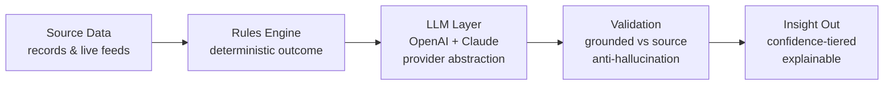
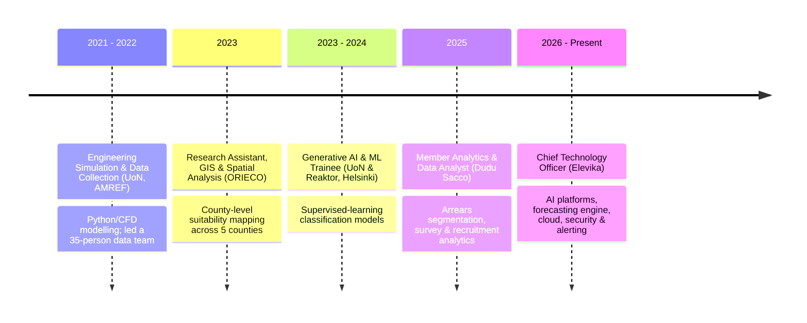

<h1 align="center">Romanus Ogolla</h1>

<b>AI, Machine Learning &amp; Full-Stack Systems Engineer</b>

  Building and shipping production digital systems end to end — predictive time-series models,
  LLM-powered analytics &amp; insight engines, data pipelines, REST APIs, cloud deployment,
  security hardening and SMS/WhatsApp alerting.

  
  
  
  
  
  
  
  

  📧 golaromanus@gmail.com &nbsp;·&nbsp; 📍 Nairobi, Kenya &nbsp;·&nbsp;
  💻 <a href="https://github.com/golaromanus">github.com/golaromanus</a>

<blockquote align="center">
  <b>Source code is in private/production repositories — full walkthrough and code review available on request.</b> 
  The projects below are live production systems. This page is a showcase of that work.
</blockquote>

---

## Selected Projects

<table>
<tr>
<td width="50%" valign="top">

### 🧠 AI Analytics &amp; Insights Platform
A production **AI insight engine** with a **multi-provider LLM integration** (OpenAI + Claude)
behind a clean provider-abstraction layer. Generates deep-analysis explanations with an
**anti-hallucination validation layer** that grounds every AI output against source data, plus a
**hybrid rules-engine + AI pipeline** with confidence-tiered outputs.

`TypeScript` · `NestJS` · `OpenAI` · `Claude` · `PostgreSQL`

</td>
<td width="50%" valign="top">

### 📈 Real-Time Time-Series Forecasting Engine
An end-to-end **predictive ML system**: a 15-feature engineering pipeline, scikit-learn / XGBoost
models with a deep-learning upgrade path, an **offline validation harness** (calibration &amp;
back-testing) and a **deployed FastAPI inference service** that learns continuously from live data.

`Python` · `scikit-learn` · `XGBoost` · `FastAPI` · `Docker`

</td>
</tr>
<tr>
<td width="50%" valign="top">

### 🏢 Qartit — Multi-Tenant Platform
A **multi-tenant SaaS platform** with isolated master + per-tenant databases and migrations,
served through an `api / web / worker` architecture with a **full observability stack**
(Grafana · Loki · Promtail · pgBouncer).

`Next.js` · `Prisma` · `PostgreSQL` · `Redis` · `Grafana`

</td>
<td width="50%" valign="top">

### 🔐 UnikQR — Hardened System with AI Insights
An `api / web / worker` system with a background **AI-insights worker** (Claude), and a
security-hardened deployment: **UFW + Cloudflare firewall**, automatic TLS via Caddy, and
**automated backup &amp; restore runbooks**.

`TypeScript` · `Docker` · `Caddy` · `UFW` · `Claude`

</td>
</tr>
<tr>
<td width="50%" valign="top">

### 💳 Payliper — Payments Platform
A payments platform spanning **web + Android + api/worker** in a single monorepo, with
**SMS / WhatsApp notification integration** (Twilio · Africa's Talking) and a containerised deploy.

`Turborepo` · `Android` · `Twilio` · `Docker`

</td>
<td width="50%" valign="top">

### ⚙️ Cloud, CI/CD &amp; Delivery
Reproducible releases across all projects: **GitHub Actions → immutable GHCR images → SSH deploy**
with Docker Compose and Caddy (auto-TLS), non-root service users, secrets management and
monitoring via Sentry + the Grafana/Loki stack.

`GitHub Actions` · `GHCR` · `Docker Compose` · `Caddy` · `Sentry`

</td>
</tr>
</table>

---

## How the AI Insight Engine Works

*The LLM never invents facts — it explains what the rules engine already decided, and every explanation is validated against the source data before it reaches the user.*

---

## Experience Timeline

---

## Core Skills

**AI / ML** — LLM integration · AI insights &amp; explainability · grounded / anti-hallucination validation · time-series forecasting · feature engineering &amp; model validation · scikit-learn · XGBoost

**Backend / Data** — Python · FastAPI · TypeScript · NestJS · REST APIs · PostgreSQL · Prisma · Redis · data pipelines &amp; systems architecture · multi-tenant design

**Cloud / DevOps / Security** — Docker · CI/CD · GHCR · Caddy · cloud deployment &amp; system administration · security hardening (UFW · Cloudflare · TLS) · backup/restore runbooks · monitoring (Grafana · Loki · Sentry)

**Integrations** — SMS / WhatsApp / email alerting (Twilio · Africa's Talking · Nodemailer)

**Other** — GIS &amp; spatial suitability analysis · Full-stack (Next.js) · Linux · C++ · CAD (AutoCAD · SolidWorks · ANSYS)

---

  © Romanus Ogolla · Full source code and live demos available on request.

